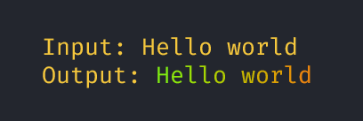

`gorainbow` lets you use a rainbow version of a string ready to print it to the terminal.



## Install
```bash
go get github.com/GiancarlosIO/gorainbow
```

## Example
```go
  import "gorainbow"

  str := Rainbow("Hello world")

  fmt.Println(str)
```
